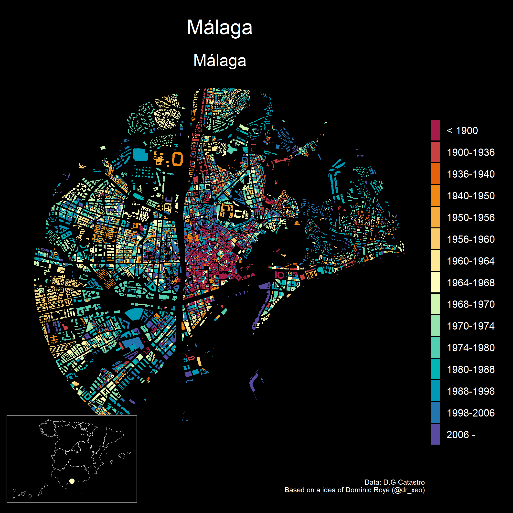
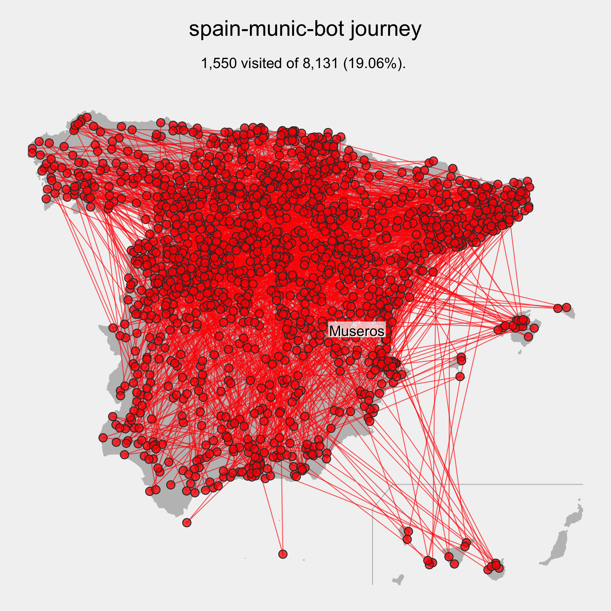

# spain-munic-bot :es::robot:

## A Twitter bot written in R

I tweet a random map of a Spanish town together with its name, province, and
autonomous community (and a inset map of Spain showing the region and the
community). The bot is set to run every 20 minutes.

## [I have a website!!](https://dieghernan.github.io/spain-munic-bot/)

## **:house: Buildings**

I create a map of the Urban Growth of Spanish cities, based on the works of
**Dominic Royé:** [Visualize urban
growth](https://dominicroye.github.io/en/2019/visualize-urban-growth/)

Find
[here](https://github.com/dieghernan/spain-munic-bot/blob/main/assets/datalog.csv)
all the maps generated by the bot.

## :airplane: The journey

## :package: R packages

Core packages used in the project are:

-   [{CatastRo}](https://ropenspain.github.io/CatastRo/) for the buildings.
-   [{mapSpain}](https://ropenspain.github.io/mapSpain/) for the location of the
    municipalities.
-   [{ggplot2}](https://ggplot2.tidyverse.org/) for plotting,
-   [{rtweet}](https://docs.ropensci.org/rtweet/) for posting,

Other packages used are {sf}, {dplyr} and another common supporting packages.

This project uses {renv} for ensuring fully reproducibility across platforms.

## 🙌🏻 Credits

-   Based on

    -   [italiancomuni](https://twitter.com/italiancomuni), by \@espinielli.

-   Automation:

    -   GitHub Actions as per \@espinielli's [GitHub
        Repo](https://github.com/espinielli/italian-comuni-bot).

-   sources:

    -   [mapSpain](https://ropenspain.github.io/mapSpain/) R package.
    -   [osmdata](https://docs.ropensci.org/osmdata/) for the streets.

## :grey_question: How to run it

From the command line it is enough to run the following command:

        $ Rscript R/trigger.R

This will trigger `R/01_create_map.R` and compose the tweet.
