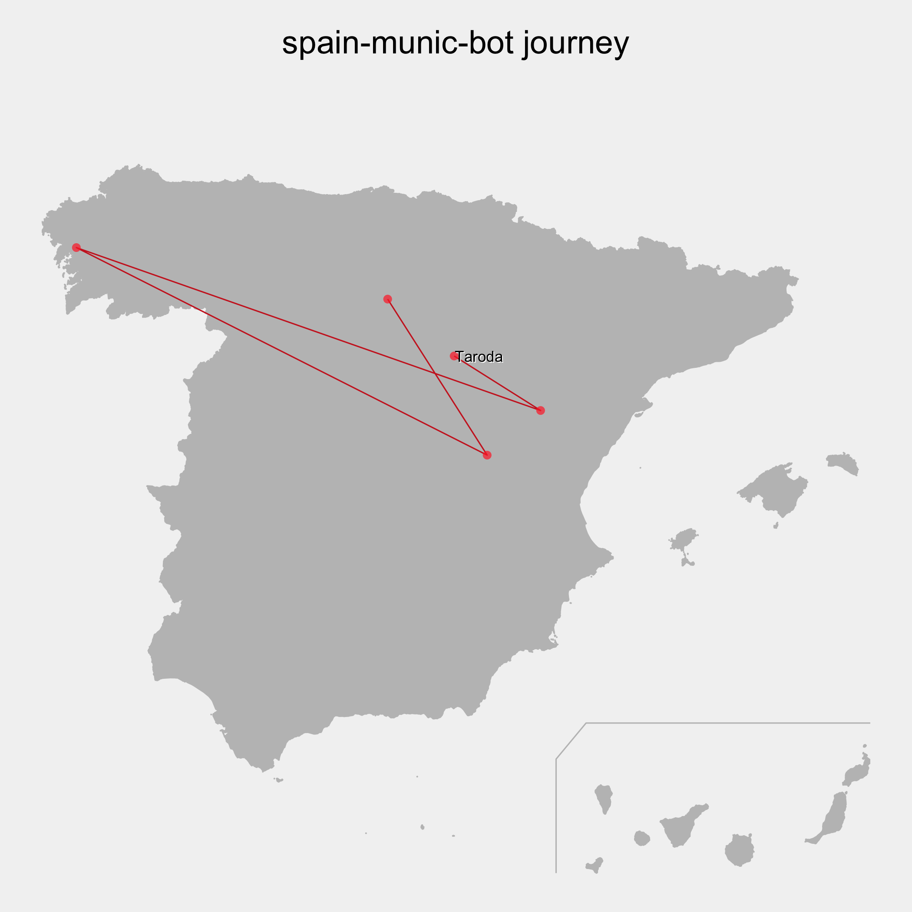

# spain-munic-bot


A Twitter bot written in R, see https://twitter.com/spainmunic for actual tweets.

It tweets a map of an Spanish town together with its name, province, and autonomous community
(and a inset map of Spain showing the region and the community).


Find [here](./data/archive) all the maps generated by the bot.

## The journey



## Credits
* Based on
  - [italiancomuni](https://twitter.com/italiancomuni), by @espinielli.

* Automation:
  - GitHub Actions as per @espinielli's [GitHub Repo](https://github.com/espinielli/italian-comuni-bot).

* sources:
  - [mapSpain](https://ropenspain.github.io/mapSpain/) R package.

## How to run it

From the command line it is enough to run the following command:
```
    $ Rscript R/tweet.R
```
This will trigger `R/01_create_map.R` and compose the tweet.

